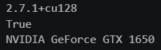
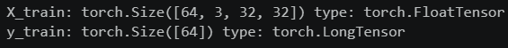
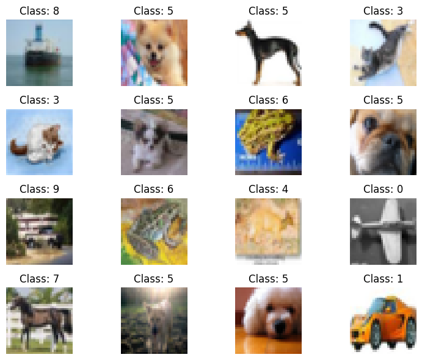
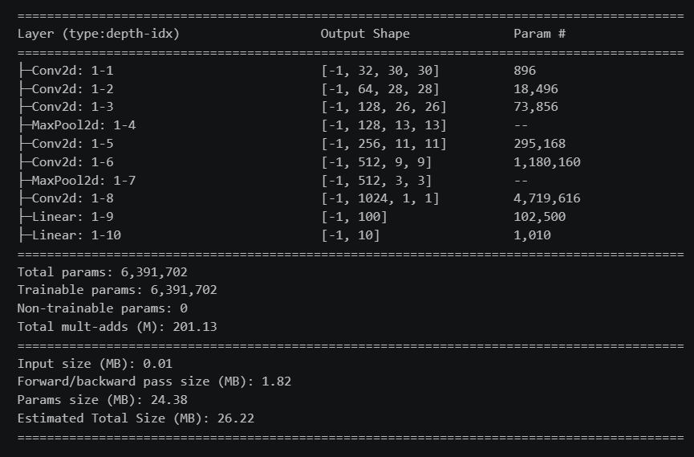
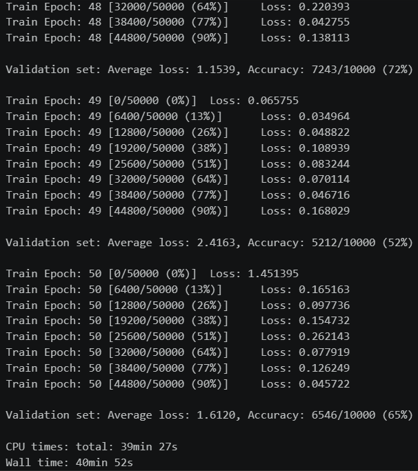
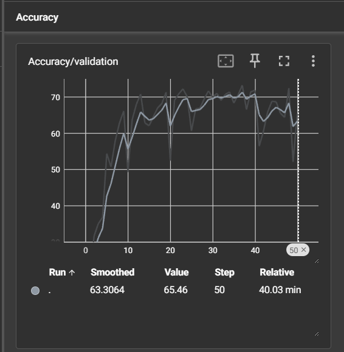
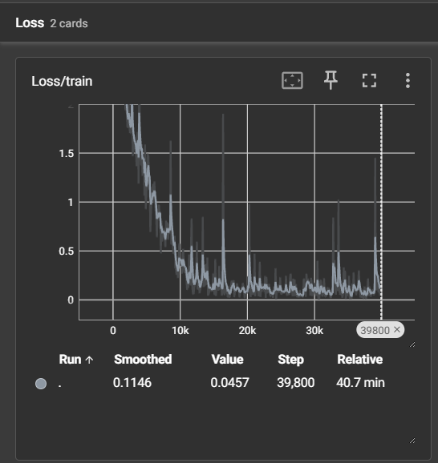
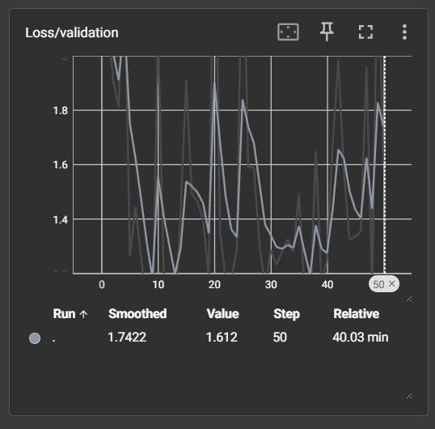

# 🧠 CNN CIFAR-10 with PyTorch


> A PyTorch-based Convolutional Neural Network for image classification on the CIFAR-10 dataset. The project implements a complete training and validation pipeline, supports GPU-accelerated training with CUDA, and uses TensorBoard for monitoring training metrics and evaluating model performance.

## 📖 Overview

This project was originally developed as a university assignment for the `Artificial Intelligence (AI)` course, using Python and PyTorch.

The objective was to implement and train a `Convolutional Neural Network (CNN)` for image classification on the `CIFAR-10 dataset`. The assignment focused on building the CNN architecture, training the model for multiple epochs, evaluating its performance on a validation set, and monitoring the training process using TensorBoard.

The original assignment required a minimum of `20 training epochs` and the graphical representation in TensorBoard of the `loss and accuracy measured on the validation set`, together with the `loss evolution during training.`

This repository contains a `refactored version of the original assignment`, featuring cleaner code, improved readability, translated comments and text to English, better organization, CUDA-enabled PyTorch dependencies, and a dedicated `.gitignore`, while preserving the original functionality and requirements.

## 📚 Original Assignment

The original assignment required implementing and training a `Convolutional Neural Network (CNN)` for image classification using the `CIFAR-10 dataset`.

The assignment required:

- Implementing the CNN architecture in PyTorch
- Using the CIFAR-10 dataset for image classification
- Training the network for a minimum of `20 epochs`
- Evaluating the model on a validation set
- Using `TensorBoard` to visualize:
  - validation loss
  - validation accuracy
  - training loss evolution

## ✨ Features

- 🧠 **Convolutional Neural Network**
  - Custom CNN architecture implemented with PyTorch
  - 6 convolutional layers with increasing numbers of filters
  - Max-pooling layers for spatial downsampling
  - Fully connected classification layers
  - 10-class output for CIFAR-10 image classification

- 🖼️ **CIFAR-10 Image Classification**
  - Training and validation on the CIFAR-10 dataset
  - Automatic dataset downloading through `torchvision`
  - Image preprocessing and normalization
  - Mini-batch training using PyTorch `DataLoader`

- ⚡ **GPU-Accelerated Training**
  - CUDA support for NVIDIA GPUs
  - Automatic device selection between CUDA and CPU
  - Training performed on the GPU when CUDA is available

- 📈 **Training and Validation**
  - Training loss and accuracy tracking
  - Validation loss and accuracy tracking
  - 50 training epochs
  - SGD optimizer with momentum
  - L2 regularization through weight decay

- 📊 **TensorBoard Monitoring**
  - Training and validation loss visualization
  - Training and validation accuracy visualization
  - Experiment metrics logged during training
  - Training progress monitored through TensorBoard

- 🔬 **Model Evaluation**
  - Validation accuracy measurement
  - Comparison between training and validation performance
  - Monitoring of model generalization
  - Identification of overfitting during training

- 🧮 **Numerical and Visualization Tools**
  - NumPy for numerical operations
  - Matplotlib for plotting and visualization

## 🧠 Model Architecture

| Layer                 | Output Shape |
| --------------------- | ------------ |
| Conv2D (32 filters)   | 30x30x32     |
| Conv2D (64 filters)   | 28x28x64     |
| Conv2D (128 filters)  | 26x26x128    |
| MaxPooling            | 13x13x128    |
| Conv2D (256 filters)  | 11x11x256    |
| Conv2D (512 filters)  | 9x9x512      |
| MaxPooling            | 3x3x512      |
| Conv2D (1024 filters) | 1x1x1024     |
| Linear                | 100          |
| Output Layer          | 10           |

## 🏗️ CNN Architecture

The following diagram illustrates the high-level architecture of the CIFAR-10 image classification pipeline, from data preprocessing and CNN training to validation and performance monitoring.

```text
                    CIFAR-10 Dataset
                           │
                           ▼
                  Data Preprocessing
                           │
                           ▼
                  Training / Validation
                           │
                           ▼
              ┌─────────────────────────┐
              │   Convolutional Neural  │
              │        Network          │
              └────────────┬────────────┘
                           │
                           ▼
                  Convolutional Layers
                           │
                           ▼
                     Max Pooling
                           │
                           ▼
                  Fully Connected Layer
                           │
                           ▼
                    Output Layer
                    (10 classes)
                           │
                           ▼
                    Model Prediction
                           │
                ┌──────────┴──────────┐
                ▼                     ▼
              Loss                 Accuracy
                │                     │
                └──────────┬──────────┘
                           ▼
                       TensorBoard
```

## 📂 Project Structure

```text
cifar10-cnn-pytorch/
├── .gitignore
├── CNN-CIFAR10-PyTorch.ipynb
├── README.md
├── LICENSE
├── requirements.txt
└── Images/
    ├── 01-cuda-environment.png
    ├── 02-dataset-loading.png
    ├── 03-training-set-examples.png
    ├── 04-model-summary.png
    ├── 05-training-results.png
    ├── 06-tensorboard-accuracy.png
    ├── 07-tensorboard-loss-train.png
    └── 08-tensorboard-loss-validation.png
```

## 🛠️ Built With

- Python
- PyTorch
- torchvision
- CUDA
- TensorBoard
- NumPy
- Matplotlib
- Jupyter Notebook

## ⭐ Highlights

- Convolutional Neural Network implemented in PyTorch for CIFAR-10 image classification
- Deep CNN architecture with 6 convolutional layers
- GPU-accelerated training using CUDA
- Training and validation pipeline implemented from scratch
- TensorBoard integration for monitoring training loss and accuracy
- SGD optimizer with momentum and L2 regularization
- Best validation accuracy of approximately **72% at epoch 37**
- Final validation accuracy of **65.46% after 50 training epochs**
- Analysis of model performance and overfitting during training
- Refactored notebook with improved code organization, naming, and readability

## 🎯 Concepts Demonstrated

- **Convolutional Neural Networks (CNNs)**  
  The project implements a deep convolutional neural network for image classification on the CIFAR-10 dataset.

- **Deep Learning with PyTorch**  
  PyTorch is used to define the neural network architecture, train the model, and evaluate its performance.

- **Image Classification**  
  The model learns to classify CIFAR-10 images into 10 different object categories.

- **Convolutional Layers**  
  Multiple convolutional layers are used to extract increasingly complex visual features from input images.

- **Pooling**  
  Max-pooling layers are used to reduce spatial dimensions while retaining important extracted features.

- **GPU Acceleration**  
  CUDA is used to accelerate model training on a compatible NVIDIA GPU.

- **Training and Validation**  
  The project implements separate training and validation pipelines for monitoring model performance during training.

- **Optimization**  
  Stochastic Gradient Descent (SGD) with momentum and L2 regularization is used to optimize the model parameters.

- **Loss and Accuracy Monitoring**  
  Training and validation loss and accuracy are tracked throughout the training process.

- **TensorBoard**  
  TensorBoard is used to visualize training metrics and analyze model performance over time.

- **Overfitting Analysis**  
  The training results are analyzed to identify overfitting and differences between training and validation performance.

- **Data Handling**  
  The CIFAR-10 dataset is loaded and processed for training and evaluation.

- **Object-Oriented Programming**  
  PyTorch's module-based architecture is used to organize the neural network and its components into reusable structures.

## 📊 Results

- Trained for 50 epochs
- Achieved a best validation accuracy of approximately **72% at epoch 37**
- Final validation accuracy after 50 epochs was **65.46%**
- Observed signs of overfitting during the later training epochs, with validation performance decreasing after reaching its peak

## 📸 Screenshots

### 1. CUDA and GPU Environment

The project verifies that CUDA is available and that the model can use an NVIDIA GPU through PyTorch.



---

### 2. Dataset Loading

The CIFAR-10 training data is loaded into PyTorch tensors. The screenshot shows the tensor dimensions, data types, and corresponding label tensor.



---

### 3. Training Set Examples

A sample mini-batch from the CIFAR-10 training set is visualized, showing 16 images together with their corresponding class labels.



---

### 4. Model Summary

The CNN architecture is displayed together with the output dimensions and number of parameters for each layer. The model contains 6,391,702 trainable parameters in total.



---

### 5. Training and Validation Results

The training process is performed for 50 epochs. The output shows the training loss, validation loss, and validation accuracy, with validation accuracy reaching approximately 72% during training.



---

### 6. Validation Accuracy

TensorBoard is used to visualize the validation accuracy throughout the training process. The graph shows the validation accuracy reaching approximately 72% during training, with a final validation accuracy of **65.46%** after 50 epochs.



---

### 7. Training Loss

TensorBoard displays the training loss throughout the training process. The loss generally decreases as the number of training steps increases.



---

### 8. Validation Loss

TensorBoard displays the validation loss for each epoch, allowing the model's performance on unseen data to be monitored throughout training.



## 🚀 Running

1. Clone the repository.

```bash
git clone <repository-url>
cd cifar10-cnn-pytorch
```

2. Create and activate a Python virtual environment.

```bash
python -m venv .venv
```

On Windows:

```bash
.venv\Scripts\activate
```

3. Install the required dependencies.

```bash
pip install -r requirements.txt
```

4. Open `CNN-CIFAR10-PyTorch.ipynb` in `Visual Studio Code` with the Jupyter extension installed.

5. Select the project's `.venv` Python environment as the Jupyter kernel.

6. Run the notebook cells in order, or use `Run All`.

The notebook will automatically:

- Download the CIFAR-10 dataset if it is not already available.
- Load and preprocess the training and validation datasets.
- Display sample training images.
- Create and summarize the CNN model.
- Train the model for 50 epochs.
- Evaluate the model on the validation dataset.
- Log training and validation metrics to TensorBoard.

7. TensorBoard can be launched from the notebook using:

```python
%load_ext tensorboard
%tensorboard --logdir=runs/CNN_CIFAR10
```

The TensorBoard interface displays the validation accuracy, training loss, and validation loss throughout the training process.

## 📄 License

This project is released under the **MIT License**.

See the [LICENSE](LICENSE) file for more details.
